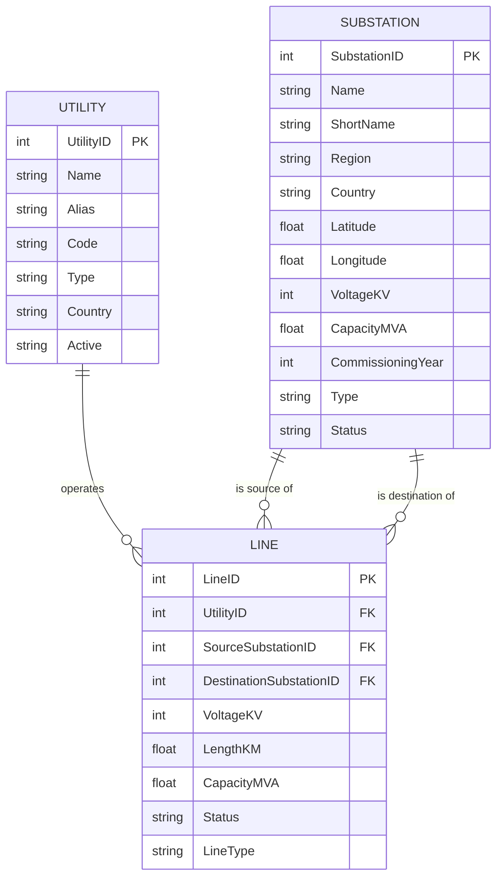

# Grid Network Analysis - Entity Relationship Diagram

Week 1 / Part A Task 1.3 deliverable: the entity-relationship diagram for
the three raw datasets used by the grid-analysis component. This models the
raw CSVs as generated by `generate_data.py` and loaded/validated by
`src/cleaning.py` - see `grid-analysis-data-dictionary.md` in this same
folder for a full field-by-field description.

## Relationship notes

- **UTILITY -> LINE** (one-to-many): every line is operated by exactly one
  utility (`Line.Utility ID` -> `Utility.Utility ID`), but a utility can
  operate many lines. GRIDCo (utility ID 3), for example, operates the most
  lines in the generated dataset.
- **SUBSTATION -> LINE** (one-to-many, twice over): every line has exactly
  one source substation and one destination substation, each referencing
  `Substation.Substation ID`. A single substation can appear as the source
  or destination of many different lines - this is exactly what
  `src/cleaning.py`'s referential-integrity check verifies (every
  `Source Substation ID` / `Destination Substation ID` in `lines.csv` must
  resolve to a real row in `substations.csv`).
- There is no direct relationship between UTILITY and SUBSTATION in this
  dataset - a utility's connection to a substation only exists indirectly,
  through the lines it operates that touch that substation.
- All three foreign keys (`Utility ID`, `Source Substation ID`,
  `Destination Substation ID`) are validated by `clean_and_validate()` in
  `src/cleaning.py`, and this validation is unit-tested in
  `tests/test_cleaning.py` using deliberately broken sample data.
