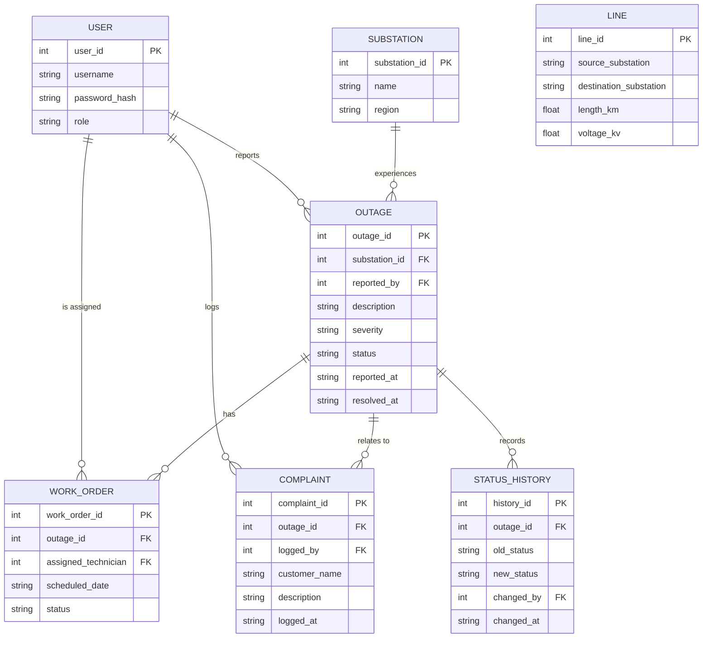

# GridCare-Lite — Entity Relationship Diagram

The SQLite schema in `gridcare-lite/db/schema.sql`, as created and seeded
by `gridcare-lite/models/database.py`. See `gridcare-lite-data-dictionary.md`
in this same folder for a field-by-field description.

## Relationship notes

- **USER -> OUTAGE** (`reported_by`): whoever logged the outage — the
  demonstration workflow has an engineer do this, but the model layer
  (`models/outages.py::report_outage`) doesn't restrict it to that role,
  since a real utility might have other staff report faults too.
- **SUBSTATION -> OUTAGE**: an outage must reference a real substation —
  enforced both by the `FOREIGN KEY` constraint and, before that, by an
  explicit existence check in `report_outage()` so the error message is
  clear rather than a raw SQLite integrity error.
- **OUTAGE -> WORK_ORDER** (one-to-many in the schema, one-in-practice in
  the demo workflow): `models/work_orders.py::assign_work_order` requires
  `admin` role and a valid `technician`-role assignee, and moves the
  parent outage to `In Progress` at the same time.
- **USER -> WORK_ORDER** (`assigned_technician`): a technician can only
  update a work order assigned to *them* — enforced in
  `models/work_orders.py::update_status`, independent of the GUI only
  showing that technician their own orders.
- **OUTAGE -> COMPLAINT** (`outage_id`, nullable): a complaint may
  optionally link to a known outage; `logged_by` records which
  `customer_service`/`admin` user recorded it, and `customer_name` records
  who actually complained (an extension over the base project spec, which
  only required `outage_id`, `logged_by`, `description`, `logged_at`).
- **`lines`** has no foreign keys in the current schema — it's reference
  data imported wholesale from `grid-analysis/data/lines.csv`, not yet
  wired into any GridCare-Lite workflow (outages currently reference
  substations directly, not specific lines).
- **STATUS_HISTORY**: every outage status transition (`Open` on creation,
  `In Progress` on work-order assignment or technician start, `Resolved`
  on completion) is recorded here with who made the change and when — see
  `models/status_history.py`, called from `models/outages.py` and
  `models/work_orders.py`.
